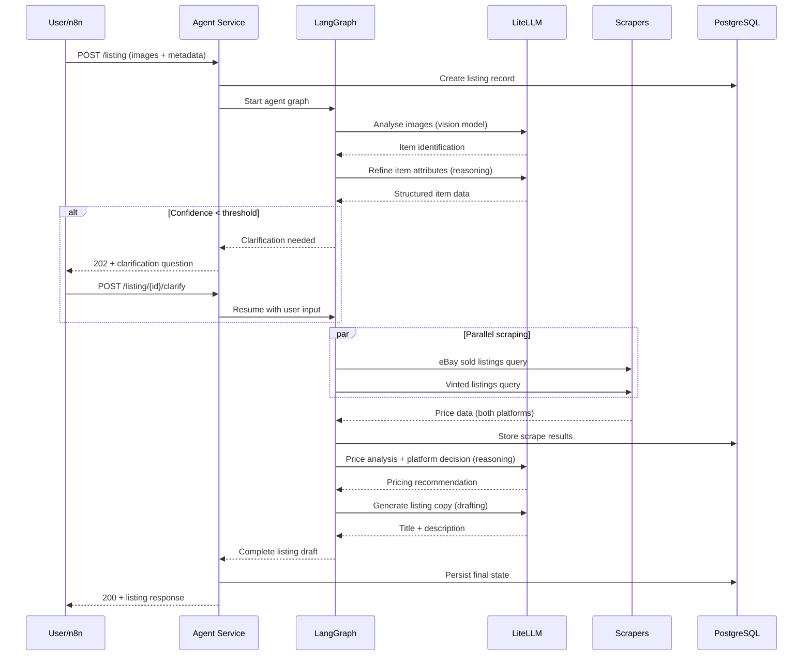
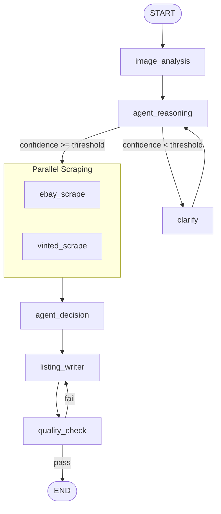

# Hybrid eBay/Vinted Listing Agent – Full Technical Specification

> **Version**: 1.0  
> **Date**: 2026-03-17  
> **Status**: Draft – Pending Review  
> **Base Document**: [initial_spec.md](file:///home/samir/marketplace-agent/specs/initial_spec.md)

---

## Preamble: Analysis of Initial Specification

The initial spec provides a solid architectural foundation. This section documents gaps identified and the improvements made in this full specification.

### Strengths Retained
- Clear LangGraph node decomposition with well-defined responsibilities
- Sensible LiteLLM dual-model routing (reasoning vs drafting)
- Good separation between agent service, tool layer, and UI/orchestration
- Appropriate use of Pydantic models and structured state

### Gaps Addressed in This Specification

| Area | Gap | Resolution |
|------|-----|------------|
| **Error Handling** | No strategy for LLM failures, timeouts, or partial scraper results | §6 Resilience & Error Handling |
| **Retry & Circuit Breakers** | No retry policies or degraded-mode behaviour defined | §6.2 Circuit Breaker Pattern |
| **Image Handling** | No upload size limits, format validation, or storage lifecycle | §4.4 Image Pipeline |
| **Security** | No auth model, input sanitisation, or rate limiting | §10 Security |
| **Prompt Engineering** | No prompt templates or versioning strategy | §5.5 Prompt Management |
| **Testing Strategy** | No test plan, coverage targets, or test categories | §11 Testing Strategy |
| **Cost Management** | No LLM token budgets or cost guardrails | §7.3 Cost Controls |
| **Observability** | Logging mentioned but no structured approach | §9 Observability |
| **Database Migrations** | No migration tooling or versioning | §4.3 Database Migrations |
| **Concurrency** | No parallel scraping or request throughput design | §5.3 Parallel Execution |
| **Configuration** | Inline magic numbers (thresholds, limits) not externalised | §3 Configuration |
| **n8n Contract** | Webhook payloads and error responses underspecified | §8 n8n Integration |

### Key Design Decisions Changed

1. **LangChain removed as explicit dependency** — LangGraph v0.2+ includes its own tool and prompt infrastructure. Keeping LangChain adds unnecessary weight. Tools are defined as plain Python functions decorated with `@tool`.
2. **Image analysis promoted from "optional" to core** — Without image analysis, the agent cannot fulfil its primary use case. This is now a required node.
3. **Async-first throughout** — All nodes, tools, and API handlers are `async`. Synchronous scraper libraries are wrapped with `asyncio.to_thread()`.
4. **Structured outputs enforced** — LLM calls that populate state fields use structured output parsing (Pydantic models with `with_structured_output()`), not free-text extraction.

---

## 1. Overview

### 1.1 Purpose

A self-hosted, Python-based AI agent that helps users list items on eBay and Vinted by:

1. Analysing item photos to identify product, brand, condition, and attributes.
2. Researching recent sold/comparable prices on eBay and Vinted via scrapers.
3. Recommending optimal pricing and platform selection.
4. Generating SEO-optimised, platform-appropriate listing titles and descriptions.

### 1.2 Design Principles

| Principle | Implementation |
|-----------|---------------|
| **Privacy-first** | Sensitive data processed locally via Ollama where possible; PII never logged |
| **Graceful degradation** | Agent produces best-effort output even when scrapers or LLMs partially fail |
| **Extensibility** | New marketplaces and tools added without changing the core graph |
| **Structured over free-text** | All LLM outputs parsed into typed models, never raw strings in state |
| **Async-native** | All I/O-bound operations are async; blocking calls wrapped |
| **Cost-aware** | Token budgets and model routing minimise cloud LLM spend |

### 1.3 Tech Stack

| Component | Technology | Version |
|-----------|-----------|---------|
| Language | Python | 3.11+ |
| Agent Framework | LangGraph | ≥ 0.2 |
| API Framework | FastAPI | ≥ 0.110 |
| LLM Gateway | LiteLLM | Latest |
| Cloud LLM | OpenAI GPT-4o / GPT-4 Turbo | Latest |
| Local LLM | Ollama (Llama 3, LLaVA for vision) | Latest |
| Database | PostgreSQL | 16+ |
| Migrations | Alembic | Latest |
| Object Storage | Local filesystem (MinIO optional) | — |
| Workflow / UI | n8n | Latest |
| Containerisation | Docker + Docker Compose | — |
| Logging | structlog | Latest |
| Testing | pytest + pytest-asyncio | Latest |
| Linting | ruff | Latest |
| Type Checking | mypy (strict) | Latest |

---

## 2. System Architecture

### 2.1 Component Diagram

```
┌─────────────┐     HTTP/Webhook      ┌──────────────────────┐
│     n8n      │ ──────────────────▶   │   Agent Service      │
│  (UI/Flows)  │ ◀──────────────────   │   (FastAPI)          │
└─────────────┘     JSON responses     │                      │
                                       │  ┌────────────────┐  │
                                       │  │  LangGraph     │  │
                                       │  │  Agent Graph   │  │
                                       │  └───┬──────┬─────┘  │
                                       │      │      │        │
                                       │  ┌───▼──┐ ┌─▼─────┐  │
                                       │  │Tools │ │ LLM   │  │
                                       │  │Layer │ │Client │  │
                                       │  └──┬───┘ └──┬────┘  │
                                       └─────┼────────┼───────┘
                                             │        │
                              ┌──────────────┘        └──────────────┐
                              ▼                                      ▼
                    ┌──────────────────┐                  ┌──────────────────┐
                    │  External APIs   │                  │  LiteLLM Gateway │
                    │  - Apify (eBay)  │                  │                  │
                    │  - Vinted Scraper│                  │  ┌────────────┐  │
                    └──────────────────┘                  │  │  OpenAI    │  │
                                                         │  ├────────────┤  │
                              ┌───────────────┐          │  │  Ollama    │  │
                              │  PostgreSQL   │          │  └────────────┘  │
                              │  + Alembic    │          └──────────────────┘
                              └───────────────┘
                              ┌───────────────┐
                              │  File Storage │
                              │  (images)     │
                              └───────────────┘
```

### 2.2 Data Flow



### 2.3 Request Lifecycle

| Phase | Duration Target | Components |
|-------|----------------|------------|
| Image upload & validation | < 1s | FastAPI, file storage |
| Image analysis | 2–8s | Vision LLM |
| Scraping (parallel) | 5–30s | Apify, Vinted library |
| Price analysis & decision | 2–5s | Reasoning LLM |
| Listing generation | 3–8s | Drafting LLM |
| **Total (happy path)** | **12–52s** | — |

---

## 3. Configuration

All configuration managed via Pydantic Settings, loaded from environment variables with `.env` fallback in development.

### 3.1 Settings Schema

```python
from pydantic_settings import BaseSettings

class Settings(BaseSettings):
    # Database
    database_url: str
    database_pool_size: int = 10
    database_max_overflow: int = 5

    # LiteLLM
    litellm_url: str = "http://litellm:4000"
    litellm_api_key: str = ""

    # Model routing
    reasoning_model: str = "openai/gpt-4o"
    vision_model: str = "openai/gpt-4o"
    drafting_model: str = "ollama/llama3"

    # Agent thresholds
    confidence_threshold: float = 0.7
    price_discount_pct: float = 10.0
    max_scraper_results: int = 50
    scraper_timeout_seconds: int = 30

    # Image handling
    max_image_size_mb: int = 10
    max_images_per_listing: int = 10
    allowed_image_formats: list[str] = ["jpeg", "jpg", "png", "webp", "heic"]
    image_storage_path: str = "/data/images"

    # Cost controls
    max_tokens_per_listing: int = 8000
    max_llm_cost_per_listing_usd: float = 0.50

    # Scraper config
    apify_api_token: str = ""
    apify_ebay_actor_id: str = "caffein.dev/ebay-sold-listings"
    ebay_country: str = "GB"
    vinted_country: str = "GB"

    # API
    api_host: str = "0.0.0.0"
    api_port: int = 8000
    api_rate_limit_rpm: int = 30

    class Config:
        env_file = ".env"
        env_prefix = "MARKETPLACE_"
```

### 3.2 LiteLLM Configuration

```yaml
# litellm_config.yaml
model_list:
  - model_name: reasoning
    litellm_params:
      model: openai/gpt-4o
      api_key: os.environ/OPENAI_API_KEY
      max_tokens: 4096

  - model_name: vision
    litellm_params:
      model: openai/gpt-4o
      api_key: os.environ/OPENAI_API_KEY
      max_tokens: 2048

  - model_name: drafting
    litellm_params:
      model: ollama/llama3
      api_base: http://ollama:11434
      max_tokens: 4096

router_settings:
  routing_strategy: "usage-based-routing-v2"
  enable_tag_filtering: true

general_settings:
  master_key: os.environ/LITELLM_MASTER_KEY
```

---

## 4. Data Model & Storage

### 4.1 Agent State (`ListState`)

```python
from typing import TypedDict, Optional

class PriceStats(TypedDict):
    num_listings: int
    avg_price: float
    median_price: float
    min_price: float
    max_price: float
    items: list[dict]  # Sample of scraped items

class ListingDraft(TypedDict):
    title: str                          # ≤ 80 chars (eBay constraint)
    description: str                    # 200–400 words
    category_suggestions: list[str]
    shipping_suggestion: str
    returns_policy: str
    platform_variants: dict[str, dict]  # Platform-specific overrides

class ListState(TypedDict):
    # Conversation
    messages: list
    run_id: str

    # Item identification
    item_description: str
    item_type: str
    brand: Optional[str]
    model_name: Optional[str]          # e.g., "WH-1000XM5" — added
    size: Optional[str]
    color: Optional[str]
    condition: str                      # "New" | "Excellent" | "Good" | "Fair" | "Poor"
    condition_notes: Optional[str]      # Free-text condition details — added
    confidence: float
    accessories_included: list[str]     # e.g., ["original box", "cable"] — added

    # Images
    photos: list[str]                   # File paths to stored images
    image_analysis_raw: Optional[dict]  # Raw vision model output — added

    # Price research
    ebay_price_stats: Optional[PriceStats]
    vinted_price_stats: Optional[PriceStats]
    ebay_query_used: Optional[str]      # Audit trail — added
    vinted_query_used: Optional[str]    # Audit trail — added

    # Decision
    suggested_price: Optional[float]
    preferred_platform: Optional[str]   # "ebay" | "vinted" | "both"
    platform_reasoning: Optional[str]   # Explanation for platform choice — added

    # Output
    listing_draft: Optional[ListingDraft]

    # Control flow
    needs_clarification: bool
    clarification_question: Optional[str]
    error_state: Optional[str]          # Error tracking — added
    retry_count: int                    # Retry tracking — added
```

**Changes from initial spec**: Added `model_name`, `condition_notes`, `accessories_included`, `image_analysis_raw`, query audit trails, `platform_reasoning`, `error_state`, `retry_count`, and `platform_variants` in the draft.

### 4.2 Database Schema

```sql
-- Table: listings
CREATE TABLE listings (
    id UUID PRIMARY KEY DEFAULT gen_random_uuid(),
    created_at TIMESTAMPTZ NOT NULL DEFAULT now(),
    updated_at TIMESTAMPTZ NOT NULL DEFAULT now(),
    status VARCHAR(20) NOT NULL DEFAULT 'pending'
        CHECK (status IN ('pending', 'processing', 'clarification', 'completed', 'failed')),

    -- Item attributes
    item_type VARCHAR(100),
    item_description TEXT,
    brand VARCHAR(100),
    model_name VARCHAR(200),
    size VARCHAR(50),
    color VARCHAR(100),
    condition VARCHAR(20) CHECK (condition IN ('New', 'Excellent', 'Good', 'Fair', 'Poor')),
    condition_notes TEXT,
    confidence REAL,
    accessories_included JSONB DEFAULT '[]',

    -- Pricing
    suggested_price NUMERIC(10,2),
    preferred_platform VARCHAR(10),
    platform_reasoning TEXT,

    -- Generated content
    title VARCHAR(200),
    description TEXT,
    listing_draft JSONB,

    -- Full state snapshot for replay/debugging
    raw_state JSONB,

    -- Image paths
    image_paths JSONB DEFAULT '[]'
);

CREATE INDEX idx_listings_status ON listings(status);
CREATE INDEX idx_listings_created_at ON listings(created_at);

-- Table: scrape_runs
CREATE TABLE scrape_runs (
    id UUID PRIMARY KEY DEFAULT gen_random_uuid(),
    listing_id UUID NOT NULL REFERENCES listings(id) ON DELETE CASCADE,
    source VARCHAR(10) NOT NULL CHECK (source IN ('ebay', 'vinted')),
    query_string TEXT NOT NULL,
    stats JSONB,              -- PriceStats
    raw_items JSONB,          -- Sample items (capped at 10)
    item_count INTEGER,
    duration_ms INTEGER,      -- Scrape duration tracking
    error_message TEXT,       -- Null if successful
    created_at TIMESTAMPTZ NOT NULL DEFAULT now()
);

CREATE INDEX idx_scrape_runs_listing_id ON scrape_runs(listing_id);

-- Table: agent_runs (audit log)
CREATE TABLE agent_runs (
    id UUID PRIMARY KEY DEFAULT gen_random_uuid(),
    listing_id UUID NOT NULL REFERENCES listings(id) ON DELETE CASCADE,
    node_name VARCHAR(50) NOT NULL,
    started_at TIMESTAMPTZ NOT NULL DEFAULT now(),
    completed_at TIMESTAMPTZ,
    status VARCHAR(20) DEFAULT 'running',
    input_summary JSONB,      -- Sanitised input (no PII)
    output_summary JSONB,
    error_message TEXT,
    llm_model_used VARCHAR(100),
    token_usage JSONB          -- {prompt_tokens, completion_tokens, total_cost}
);

CREATE INDEX idx_agent_runs_listing_id ON agent_runs(listing_id);
```

**Additions over initial spec**: `status` field with state machine, `agent_runs` audit table, `duration_ms` for scrape performance tracking, `error_message` columns, token usage tracking, proper indexes.

### 4.3 Database Migrations

Use **Alembic** for schema versioning:

```
alembic/
├── alembic.ini
├── env.py
└── versions/
    └── 001_initial_schema.py
```

- All schema changes go through Alembic migrations — no raw DDL in production.
- Migration scripts tested in CI before deployment.
- Downgrade paths required for all migrations.

### 4.4 Image Pipeline

```
Upload → Validate → Store → Serve
```

| Step | Detail |
|------|--------|
| **Validate** | Check format (JPEG/PNG/WebP/HEIC), file size (≤ 10 MB), dimensions |
| **Convert** | HEIC → JPEG; strip EXIF metadata (privacy) |
| **Store** | `{image_storage_path}/{listing_id}/{uuid}.jpg` |
| **Serve** | Internal file paths passed to vision LLM; not publicly exposed |
| **Cleanup** | Images for failed/abandoned listings pruned after 7 days |

---

## 5. Agent Orchestration (LangGraph)

### 5.1 Graph Structure



**Changes from initial spec**: Added `image_analysis` as a dedicated first node (no longer optional), added `quality_check` node, scraping is explicitly parallel.

### 5.2 Node Specifications

#### Node: `image_analysis`
| Attribute | Value |
|-----------|-------|
| **LLM** | `vision_model` (GPT-4o via LiteLLM) |
| **Input** | `photos` (list of image paths) |
| **Output** | `item_type`, `brand`, `model_name`, `color`, `condition`, `confidence`, `accessories_included`, `image_analysis_raw` |
| **Structured output** | Pydantic model `ImageAnalysisResult` via `with_structured_output()` |
| **Fallback** | If vision LLM fails, set `confidence = 0.0` and proceed to `clarify` |

#### Node: `agent_reasoning`
| Attribute | Value |
|-----------|-------|
| **LLM** | `reasoning_model` (GPT-4o via LiteLLM) |
| **Input** | Image analysis results + any user-provided metadata |
| **Output** | Refined item attributes, `ebay_query_used`, `vinted_query_used` |
| **Logic** | Merge image analysis with user metadata (user metadata takes precedence). Construct optimised search queries for each platform. Evaluate confidence against threshold. |
| **Structured output** | Pydantic model `ReasoningResult` |

#### Node: `clarify`
| Attribute | Value |
|-----------|-------|
| **LLM** | `reasoning_model` |
| **Trigger** | `confidence < settings.confidence_threshold` OR missing required fields (`size` for clothing, `model_name` for electronics) |
| **Output** | `clarification_question` (max 2 targeted questions), `needs_clarification = True` |
| **Behaviour** | Graph halts. API returns `202 Accepted` with question. User responds via `POST /listing/{id}/clarify`. Graph resumes at `agent_reasoning`. Max 3 clarification rounds, then proceed with best-effort data. |

#### Node: `ebay_scrape` / `vinted_scrape`
| Attribute | Value |
|-----------|-------|
| **Type** | Tool node (no LLM) |
| **Input** | Platform-specific query string from `agent_reasoning` |
| **Output** | `PriceStats` dict |
| **Timeout** | `settings.scraper_timeout_seconds` (default 30s) |
| **Error handling** | On failure, set stats to `None` and record error. Agent continues with available data. |

#### Node: `agent_decision`
| Attribute | Value |
|-----------|-------|
| **LLM** | `reasoning_model` |
| **Input** | `ebay_price_stats`, `vinted_price_stats`, item attributes |
| **Output** | `suggested_price`, `preferred_platform`, `platform_reasoning` |
| **Pricing logic** | Base: median of available prices. Apply `settings.price_discount_pct` for "quick sale" recommendation. Weight by volume (more listings = higher confidence). If only one platform has data, use that platform's data with a caveat. |
| **Platform logic** | Consider: category fit (electronics → eBay, fashion → Vinted), price differential, listing volume, fees structure |
| **Structured output** | Pydantic model `PricingDecision` |

#### Node: `listing_writer`
| Attribute | Value |
|-----------|-------|
| **LLM** | `drafting_model` (Ollama/Llama 3 via LiteLLM) |
| **Input** | All item attributes, pricing decision, price stats |
| **Output** | `listing_draft` (title, description, shipping, returns, category hints) |
| **Constraints** | Title ≤ 80 chars. Description 200–400 words. Include: features, condition statement, sizing, shipping info. Generate `platform_variants` if `preferred_platform == "both"`. |
| **Structured output** | Pydantic model `ListingDraft` |

#### Node: `quality_check`
| Attribute | Value |
|-----------|-------|
| **Type** | Deterministic validation (no LLM) |
| **Checks** | Title length ≤ 80 chars, description word count 200–400, required fields populated, price is positive and reasonable (within 2x of median), no placeholder text |
| **On failure** | Retry `listing_writer` once with specific feedback. If second attempt fails, return best-effort with warnings. |

### 5.3 Parallel Execution

eBay and Vinted scraping run concurrently using LangGraph's built-in parallel fan-out:

```python
from langgraph.graph import StateGraph, START, END

graph = StateGraph(ListState)
# ... add nodes ...
graph.add_edge("agent_reasoning", "ebay_scrape")
graph.add_edge("agent_reasoning", "vinted_scrape")
graph.add_edge("ebay_scrape", "agent_decision")
graph.add_edge("vinted_scrape", "agent_decision")
# agent_decision waits for both to complete (fan-in)
```

### 5.4 State Checkpointing

Use LangGraph's `SqliteSaver` or `PostgresSaver` for checkpointing:

- Enables graph resumption after `clarify` interrupts.
- Provides full state replay for debugging.
- Checkpoint data auto-expired after 30 days.

### 5.5 Prompt Management

Prompts stored as versioned templates in `src/agents/prompts/`:

```
src/agents/prompts/
├── image_analysis.py      # IMAGE_ANALYSIS_SYSTEM, IMAGE_ANALYSIS_USER
├── reasoning.py           # REASONING_SYSTEM, REASONING_USER
├── clarification.py       # CLARIFY_SYSTEM, CLARIFY_USER
├── decision.py            # DECISION_SYSTEM, DECISION_USER
├── listing_writer.py      # WRITER_SYSTEM, WRITER_USER
└── __init__.py
```

Each prompt module contains:
- `SYSTEM` prompt (role, constraints, output format)
- `USER` template (with `{variable}` placeholders)
- Version string for tracking

---

## 6. Resilience & Error Handling

### 6.1 Retry Policies

| Component | Strategy | Max Retries | Backoff |
|-----------|----------|-------------|---------|
| LLM calls | Retry on 429/500/503 | 3 | Exponential (1s, 2s, 4s) |
| eBay scraper | Retry on timeout/5xx | 2 | Linear (2s) |
| Vinted scraper | Retry on timeout/5xx | 2 | Linear (2s) |
| Database writes | Retry on connection error | 3 | Exponential (0.5s, 1s, 2s) |

### 6.2 Circuit Breaker Pattern

For external services (scrapers, LLM gateway):

| State | Behaviour |
|-------|-----------|
| **Closed** | Normal operation. Track failure count. |
| **Open** | After 5 failures in 60s, skip calls for 30s. Return cached/empty data. |
| **Half-open** | After cooldown, allow one test request. Success → Closed. Failure → Open. |

### 6.3 Graceful Degradation Matrix

| Failure | Impact | Agent Behaviour |
|---------|--------|-----------------|
| eBay scraper fails | No eBay pricing | Use Vinted data only; add caveat to output |
| Vinted scraper fails | No Vinted pricing | Use eBay data only; add caveat to output |
| Both scrapers fail | No market data | Skip pricing; generate listing with user-provided info; flag for manual pricing |
| Vision LLM fails | No image analysis | Set confidence to 0; route to clarification |
| Drafting LLM fails | No listing copy | Fall back to reasoning LLM for drafting |
| Reasoning LLM fails | Critical | Return error; do not attempt degraded output for analysis |

### 6.4 Custom Exceptions

```python
# src/exceptions.py
class MarketplaceAgentError(Exception):
    """Base exception for all agent errors."""

class ScraperError(MarketplaceAgentError):
    """Raised when a marketplace scraper fails."""

class LLMError(MarketplaceAgentError):
    """Raised when an LLM call fails after retries."""

class ValidationError(MarketplaceAgentError):
    """Raised for input validation failures."""

class ImageProcessingError(MarketplaceAgentError):
    """Raised for image upload/processing failures."""

class ClarificationTimeoutError(MarketplaceAgentError):
    """Raised if clarification not received within deadline."""
```

---

## 7. LiteLLM Gateway

### 7.1 Model Routing

| Tag | Model | Use Case |
|-----|-------|----------|
| `vision` | GPT-4o | Image analysis (multimodal) |
| `reasoning` | GPT-4o | Item identification, pricing decisions |
| `drafting` | Ollama/Llama 3 | Listing copy generation |

### 7.2 Integration

Two LLM client instances in the agent service:

```python
from langchain_openai import ChatOpenAI

reasoning_llm = ChatOpenAI(
    base_url=f"{settings.litellm_url}/v1",
    model="reasoning",
    api_key=settings.litellm_api_key,
    temperature=0.1,
    max_tokens=4096,
)

drafting_llm = ChatOpenAI(
    base_url=f"{settings.litellm_url}/v1",
    model="drafting",
    api_key=settings.litellm_api_key,
    temperature=0.7,
    max_tokens=4096,
)
```

### 7.3 Cost Controls

| Control | Value | Enforcement |
|---------|-------|-------------|
| Max tokens per listing run | 8,000 total | Tracked via callback; abort if exceeded |
| Max cost per listing | $0.50 USD | Computed from LiteLLM usage logs |
| Monthly budget alert | Configurable | LiteLLM budget feature |
| Prefer local models | Always for drafting | Routing config |

---

## 8. API Contracts

### 8.1 `POST /listing` — Create Listing

**Request**: `multipart/form-data`

| Field | Type | Required | Description |
|-------|------|----------|-------------|
| `images` | File[] | Yes (1–10) | Item photos |
| `brand` | string | No | Known brand |
| `size` | string | No | Size info |
| `color` | string | No | Color |
| `notes` | string | No | Free-text context |
| `fast_sale` | bool | No | Apply discount pricing (default: true) |

**Response (200)**: Completed listing

```json
{
  "listing_id": "uuid",
  "status": "completed",
  "item": {
    "type": "headphones",
    "brand": "Sony",
    "model": "WH-1000XM5",
    "condition": "Good",
    "confidence": 0.91
  },
  "pricing": {
    "suggested_price": 142.00,
    "currency": "GBP",
    "preferred_platform": "ebay",
    "platform_reasoning": "Higher volume and better prices for electronics on eBay",
    "ebay_stats": { "num_listings": 47, "median_price": 158.00, "..." : "..." },
    "vinted_stats": { "num_listings": 12, "median_price": 130.00, "..." : "..." }
  },
  "listing_draft": {
    "title": "Sony WH-1000XM5 Wireless Headphones - Good Condition",
    "description": "...",
    "category_suggestions": ["Sound & Vision > Headphones"],
    "shipping_suggestion": "Royal Mail 2nd Class Signed For",
    "returns_policy": "30-day returns accepted"
  }
}
```

**Response (202)**: Clarification needed

```json
{
  "listing_id": "uuid",
  "status": "clarification",
  "clarification_question": "Can you confirm the UK shoe size? The images suggest size 9 or 10."
}
```

**Error responses**:

| Code | Condition |
|------|-----------|
| 400 | No images, invalid format, oversized files |
| 429 | Rate limit exceeded |
| 500 | Internal error (logged, not exposed) |
| 503 | LLM gateway or all scrapers unavailable |

### 8.2 `POST /listing/{id}/clarify` — Respond to Clarification

**Request**:
```json
{ "answer": "It's a UK size 10, and includes the original box" }
```

**Response**: Same as `POST /listing` (200 or 202 if further clarification needed).

### 8.3 `GET /listing/{id}` — Retrieve Listing

Returns the stored listing result. Same response shape as `POST /listing` 200.

### 8.4 `GET /health` — Health Check

```json
{
  "status": "healthy",
  "services": {
    "database": "ok",
    "litellm": "ok",
    "apify": "ok"
  },
  "version": "1.0.0"
}
```

---

## 9. Observability

### 9.1 Structured Logging

All logging via `structlog` with JSON output:

```python
import structlog
logger = structlog.get_logger()

logger.info("scrape_completed",
    source="ebay",
    listing_id=listing_id,
    num_results=47,
    duration_ms=2340,
)
```

**Log levels**:
| Level | Usage |
|-------|-------|
| `DEBUG` | LLM prompt/response (dev only, truncated) |
| `INFO` | Node transitions, scrape completions, listing created |
| `WARNING` | Scraper retries, degraded mode activated, slow responses |
| `ERROR` | Unrecoverable failures, LLM errors after retries |

### 9.2 Metrics

Exposed via Prometheus-compatible endpoint (`/metrics`):

| Metric | Type | Labels |
|--------|------|--------|
| `listing_duration_seconds` | Histogram | `status` |
| `scraper_duration_seconds` | Histogram | `source`, `status` |
| `scraper_error_total` | Counter | `source`, `error_type` |
| `llm_tokens_total` | Counter | `model`, `node` |
| `llm_cost_usd_total` | Counter | `model` |
| `listings_total` | Counter | `status` |
| `clarification_rounds_total` | Counter | — |

### 9.3 Audit Trail

Every agent run logs to the `agent_runs` table (see §4.2), tracking node name, timing, model used, token consumption, and errors. No PII stored in audit records.

---

## 10. Security

### 10.1 Authentication

| Layer | Mechanism |
|-------|-----------|
| n8n → Agent Service | API key in `Authorization` header |
| Agent Service → LiteLLM | LiteLLM master key |
| Agent Service → Apify | Apify API token |

### 10.2 Input Validation

- All request bodies validated via Pydantic schemas (reject unknown fields).
- Image files validated: format, size, and basic integrity before processing.
- Free-text inputs (notes, answers) capped at 2,000 characters.
- SQL injection prevented via SQLAlchemy parameterised queries only.

### 10.3 Privacy

- EXIF metadata stripped from uploaded images before storage.
- PII never logged — use `structlog` processors to redact sensitive fields.
- Ollama preferred for verbose content generation (data stays local).
- No user images sent to external services other than the configured vision LLM.

### 10.4 Rate Limiting

- API-level: configurable RPM per client (default 30 RPM).
- Scraper-level: respect Apify rate limits; Vinted requests throttled to 1 req/s.

---

## 11. Testing Strategy

### 11.1 Test Pyramid

| Layer | Coverage Target | Tools |
|-------|----------------|-------|
| **Unit tests** | > 80% of business logic | pytest, pytest-asyncio |
| **Integration tests** | All API endpoints, DB operations | pytest, httpx, testcontainers |
| **End-to-end tests** | Happy path + clarification flow | pytest + mocked external services |

### 11.2 Mocking Strategy

| External Service | Mock Approach |
|-----------------|---------------|
| LLM calls | `unittest.mock.patch` on LLM client; return canned structured outputs |
| eBay scraper (Apify) | Mock HTTP responses with `respx` or `responses` library |
| Vinted scraper | Mock library calls; return fixture data |
| PostgreSQL | Testcontainers for integration; in-memory SQLite for unit |
| File storage | `tmp_path` pytest fixture |

### 11.3 Key Test Scenarios

| Scenario | Type | Validates |
|----------|------|-----------|
| Happy path (images → listing) | E2E | Full graph execution |
| Clarification flow (low confidence) | E2E | Graph pause/resume |
| eBay scraper failure | Integration | Graceful degradation |
| Both scrapers fail | Integration | Degradation with no pricing |
| Invalid image format | Unit | Upload validation |
| Title too long | Unit | Quality check node |
| LLM returns malformed output | Unit | Structured output error handling |
| Concurrent requests | Integration | No state leakage between runs |

### 11.4 Test Commands

```bash
# All tests
pytest

# Unit only
pytest tests/unit/ -v

# Integration only
pytest tests/integration/ -v

# With coverage
pytest --cov=src --cov-report=html

# Single test
pytest tests/unit/test_image_pipeline.py::test_heic_conversion -v
```

---

## 12. Deployment

### 12.1 Docker Compose Services

| Service | Image | Ports | Depends On |
|---------|-------|-------|------------|
| `agent-service` | Custom (Dockerfile) | 8000 | postgres, litellm |
| `litellm` | `ghcr.io/berriai/litellm` | 4000 | ollama |
| `ollama` | `ollama/ollama` | 11434 | — |
| `postgres` | `postgres:16-alpine` | 5432 | — |
| `n8n` | `n8nio/n8n` | 5678 | agent-service |

### 12.2 Startup Order

1. `postgres` — database ready
2. `ollama` — pull required models on first start
3. `litellm` — connects to Ollama and verifies OpenAI key
4. `agent-service` — runs Alembic migrations, then starts FastAPI
5. `n8n` — imports workflow templates

### 12.3 Health Checks

Each service exposes a health endpoint. Docker Compose `healthcheck` configured with:
- Interval: 10s
- Timeout: 5s
- Retries: 3

---

## 13. n8n Integration

### 13.1 Workflow Template

```
Trigger (webhook/UI form)
  → Upload images to Agent Service (POST /listing)
  → Check response status
  → IF status == "clarification":
      → Present question to user (form/chat)
      → Submit answer (POST /listing/{id}/clarify)
      → Loop back to status check
  → IF status == "completed":
      → Display listing draft
      → Optional: "Post to eBay" / "Post to Vinted" actions
  → IF status == "failed":
      → Display error message
      → Notify admin
```

### 13.2 Webhook Payload (n8n → Agent Service)

Multipart form matching the `POST /listing` contract. n8n HTTP Request node configured with:
- Method: POST
- URL: `http://agent-service:8000/listing`
- Authentication: Header Auth (`X-API-Key`)
- Body: Form-Data (images + metadata fields)

---

## 14. Project Structure

```
marketplace-agent/
├── src/
│   ├── api/
│   │   ├── __init__.py
│   │   ├── routes.py           # FastAPI endpoint definitions
│   │   ├── schemas.py          # Request/response Pydantic models
│   │   └── dependencies.py     # Dependency injection (DB, LLM clients)
│   ├── agents/
│   │   ├── __init__.py
│   │   ├── graph.py            # LangGraph graph definition
│   │   ├── nodes/
│   │   │   ├── __init__.py
│   │   │   ├── image_analysis.py
│   │   │   ├── agent_reasoning.py
│   │   │   ├── clarify.py
│   │   │   ├── scrape_ebay.py
│   │   │   ├── scrape_vinted.py
│   │   │   ├── agent_decision.py
│   │   │   ├── listing_writer.py
│   │   │   └── quality_check.py
│   │   └── prompts/
│   │       ├── __init__.py
│   │       ├── image_analysis.py
│   │       ├── reasoning.py
│   │       ├── clarification.py
│   │       ├── decision.py
│   │       └── listing_writer.py
│   ├── tools/
│   │   ├── __init__.py
│   │   ├── ebay_scraper.py
│   │   └── vinted_scraper.py
│   ├── models/
│   │   ├── __init__.py
│   │   ├── state.py            # ListState TypedDict
│   │   └── database.py         # SQLAlchemy models
│   ├── services/
│   │   ├── __init__.py
│   │   ├── image_service.py    # Image validation, storage, EXIF stripping
│   │   └── pricing_service.py  # Price calculation utilities
│   ├── db/
│   │   ├── __init__.py
│   │   ├── session.py          # Async SQLAlchemy session factory
│   │   └── repositories.py    # Data access layer
│   ├── exceptions.py
│   ├── config.py               # Pydantic Settings
│   └── main.py                 # FastAPI app factory
├── alembic/
│   ├── alembic.ini
│   ├── env.py
│   └── versions/
├── tests/
│   ├── unit/
│   ├── integration/
│   ├── e2e/
│   ├── fixtures/
│   └── conftest.py
├── docker/
│   ├── Dockerfile
│   ├── docker-compose.yml
│   └── litellm_config.yaml
├── n8n/
│   └── workflows/              # Exportable n8n workflow JSON
├── specs/
│   ├── initial_spec.md
│   └── technical_specification.md
├── pyproject.toml
├── AGENTS.md
├── README.md
└── .env.example
```

---

## 15. Implementation Phases

### Phase 1: Foundation (Week 1–2)
- [ ] Project scaffolding, Docker Compose, CI
- [ ] Database schema + Alembic migrations
- [ ] Configuration management (Pydantic Settings)
- [ ] LiteLLM gateway setup with both model backends
- [ ] Health check endpoint
- [ ] Image upload + validation pipeline

### Phase 2: Core Agent (Week 3–4)
- [ ] Image analysis node with structured output
- [ ] Agent reasoning node
- [ ] Clarification flow (pause/resume)
- [ ] eBay scraper tool (Apify integration)
- [ ] Vinted scraper tool
- [ ] LangGraph graph assembly with parallel scraping

### Phase 3: Intelligence (Week 5–6)
- [ ] Pricing decision node with platform logic
- [ ] Listing writer node with platform variants
- [ ] Quality check node
- [ ] Full API endpoints (create, clarify, retrieve)
- [ ] Error handling + graceful degradation

### Phase 4: Production Readiness (Week 7–8)
- [ ] n8n workflow template
- [ ] Structured logging + metrics endpoint
- [ ] Rate limiting
- [ ] Authentication
- [ ] Comprehensive test suite
- [ ] Documentation (README, API docs, deployment guide)

---

## 16. Open Questions for Review

> [!IMPORTANT]
> The following decisions should be confirmed before implementation begins.

1. **Vision model preference**: GPT-4o for image analysis, or should we explore LLaVA via Ollama for fully local image processing (lower quality but zero cloud cost)?
2. **Vinted scraper approach**: Python library (`vinted-scraper`) vs Apify actor? The library is free but may break with Vinted API changes. Apify is more resilient but adds cost.
3. **Currency handling**: Is GBP the only currency, or should the system support multi-currency with conversion?
4. **Listing auto-posting**: Should Phase 1 include actual posting to eBay/Vinted via their APIs, or is the draft/recommendation output sufficient initially?
5. **User authentication**: Is single-user (API key) sufficient, or will multiple users need separate accounts and listing histories?
